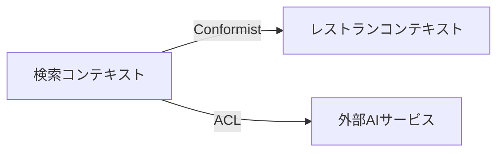
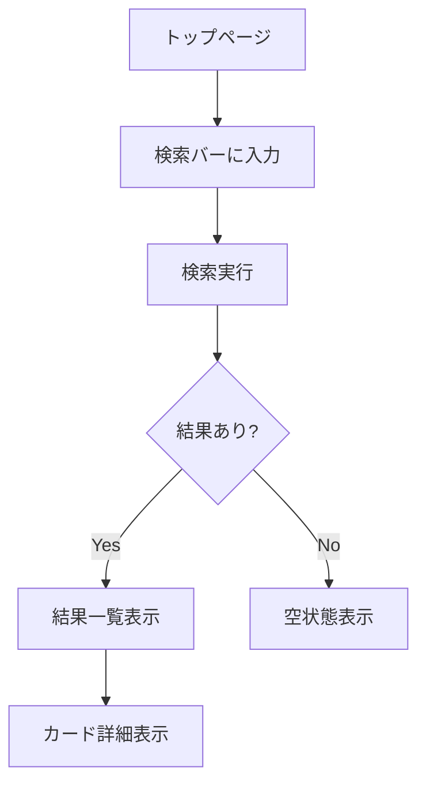

# フェーズ詳細ガイド

各フェーズの詳細な進め方を説明する。SKILL.md の概要とあわせて参照すること。

## DDDモデリング詳細（Phase 4）

### 戦略的DDDに集中する理由

戦略的 DDD の目的は「正しい境界で分割し、チーム内で共通の言葉を使う」こと。
実装パターン（エンティティ、値オブジェクト等）は技術設計フェーズで扱うので、ここでは以下に集中する。

### ステップ

#### 1. ユビキタス言語の定義

対象ドメインの用語をユーザーと合わせる。コード上の変数名にもこの用語を使う。

```markdown
## ユビキタス言語

| 用語 | 定義 | コード上の表現 |
|------|------|----------------|
| 検索意図 | ユーザーの自然言語入力から抽出した構造化された要求 | `SearchIntent` |
| マッチスコア | レストランと検索意図の適合度（0-100） | `matchScore` |
```

用語は既存コードベースで使われている名前との整合性を必ず確認する。
乖離がある場合はリネームの提案をドメインに関する確認事項に記載。

#### 2. 境界づけられたコンテキスト

機能を独立したコンテキストに分割する。小規模プロジェクトでもコンテキストを意識することで、ディレクトリ構成やモジュール分割の指針になる。

```markdown
## 境界づけられたコンテキスト

### 検索コンテキスト
- 責務: ユーザー入力の解釈、検索実行、結果のランキング
- 主要概念: SearchQuery, SearchIntent, SearchResult
- 外部依存: レストランコンテキスト（読み取りのみ）

### レストランコンテキスト
- 責務: レストラン情報の管理、カテゴリ分類
- 主要概念: Restaurant, Category, Location
- 外部依存: なし
```

#### 3. コンテキストマップ

コンテキスト間の関係を Mermaid で可視化する。



関係パターン（Conformist, ACL, Shared Kernel 等）を明示する。

#### 4. ドメインイベント

システム内で重要な出来事を洗い出す。これが後の API 設計やイベント駆動設計の入力になる。

```markdown
## ドメインイベント

| イベント | トリガー | 発行元 | 消費者 |
|---------|---------|--------|--------|
| SearchExecuted | ユーザーが検索を実行 | 検索コンテキスト | 分析コンテキスト |
```

#### 5. 既存コードとの整合性

新しいドメインモデルが既存のコード構造とどう対応するか分析する。
既存の命名・ディレクトリ構成との整合性を評価し、必要な変更を提案する。

---

## UI/UXデザイン詳細（Phase 5）

### Storybook プロトタイピングの進め方

Phase 5 の目的は「ユーザーがブラウザで動作確認できるプロトタイプ」を作ること。
完全な機能実装ではなく、UI の見た目・インタラクションの合意を得ることが目標。

### ステップ

#### 1. ユーザーフロー設計

ユーザーが機能をどう使うか、フロー図で整理する。



#### 2. コンポーネント設計

新規コンポーネントと既存コンポーネントの再利用を整理する。

```markdown
## コンポーネント構成

### 新規作成
- `FilterPanel/` — 検索フィルターUI
  - props: filters, onFilterChange
  - 状態: 選択中のフィルター値

### 既存再利用
- `SearchBar/` — 既存の検索バー（変更なし）
- `RestaurantCard/` — 既存のカード（プロップ追加の可能性）

### shadcn/ui 使用
- `Select` — フィルタードロップダウン
- `Checkbox` — 複数選択フィルター
```

#### 3. Storybook ストーリー作成

プロトタイプとして以下の粒度で作成する:

- **個別コンポーネント**: 各状態（デフォルト、ローディング、エラー、空）のストーリー
- **コンポジション**: 複数コンポーネントを組み合わせた画面レベルのストーリー

```typescript
// FilterPanel/FilterPanel.stories.tsx
import type { Meta, StoryObj } from '@storybook/react';
import { FilterPanel } from './FilterPanel';

const meta = {
  title: 'Features/Search/FilterPanel',
  component: FilterPanel,
  tags: ['autodocs'],
} satisfies Meta<typeof FilterPanel>;

export default meta;
type Story = StoryObj<typeof meta>;

export const Default: Story = {
  args: {
    filters: mockFilters,
    onFilterChange: fn(),
  },
};

export const WithSelection: Story = { /* ... */ };
export const Loading: Story = { /* ... */ };
export const Empty: Story = { /* ... */ };
```

**重要**: プロトタイプ段階では:
- API 呼び出しはモックデータで代替
- 状態管理は最小限（ローカル state のみ）
- スタイリングはプロジェクトの既存パターンに合わせる（shadcn/ui + Tailwind）
- 既存コンポーネントの配置場所・命名規約に従う

#### 4. インタラクション定義

状態遷移とフィードバックを明示する。

```markdown
## インタラクション

| 操作 | 状態変化 | フィードバック |
|------|---------|---------------|
| フィルター選択 | selected → applied | 即時反映、件数更新 |
| 検索実行中 | idle → loading | スケルトンUI表示 |
| エラー発生 | → error | Alert コンポーネント表示 |
```

#### 5. アクセシビリティ

- キーボードナビゲーション
- スクリーンリーダー対応（aria-label 等）
- カラーコントラスト
- フォーカス管理

---

## 実装パターン（Phase 7）

### 段階的実装の原則

1. **依存関係の順にボトムアップで実装**: DB スキーマ → バックエンド → フロントエンド
2. **各ステップで動作確認可能な状態を保つ**: 中間状態でもテスト可能にする
3. **既存パターンに従う**: 新しいパターンを導入する前に、既存コードの慣習を確認する

### サブエージェントによる並行実装

独立性が高い場合（例: バックエンド API とフロントエンド UI が interface で切れている場合）、サブエージェントで並行実装できる。

**並行実装の条件**:
- 編集対象のファイルが完全に分離されている
- 共通の型定義が先に確定している
- インターフェース（API 契約）が合意済み

**委任時の指示テンプレート**:
```
以下のタスクを実装してください:
- 対象: {コンポーネント/モジュール名}
- 技術設計: {technical-design.md のパス}（該当セクションを参照）
- プロジェクト規約: {CLAUDE.md のパス}
- 既存パターン参考: {既存の類似ファイルのパス}
- 出力先: {ディレクトリパス}
```

---

## テスト戦略（Phase 8）

### ユースケースからテストへの変換

`usecases.md` の各シナリオを対応するテストに変換する。

| ユースケース種別 | テスト種別 | 例 |
|-----------------|----------|-----|
| 正常系 | ユニット + 統合 | 有効な入力で期待通りの結果 |
| 異常系 | ユニット | バリデーションエラーの検証 |
| エッジケース | ユニット | 境界値、null/undefined |
| ユーザーフロー | E2E | 画面操作の一連の流れ |

### テスト作成の優先順位

1. **ビジネスロジック**: ドメイン層のロジック（最優先）
2. **API エンドポイント**: リクエスト/レスポンスの検証
3. **UI インタラクション**: ユーザー操作とフィードバック
4. **E2E**: 主要ハッピーパスのみ（コスト対効果を考慮）

### テスト品質チェック

- テスト名がシナリオを説明しているか
- Arrange-Act-Assert パターンに従っているか
- モックの範囲が適切か（過剰モックを避ける）
- フレイキーテストの兆候がないか
