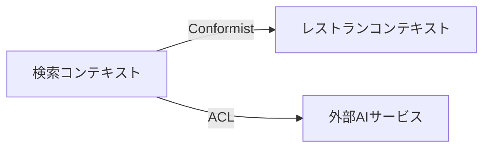
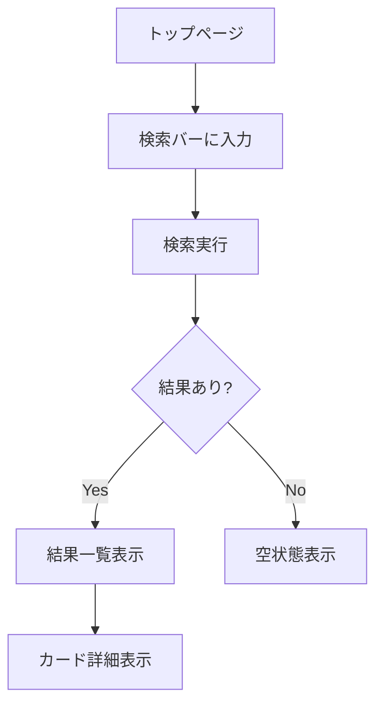

# フェーズ詳細ガイド

各フェーズの詳細な進め方を説明する。SKILL.md の概要とあわせて参照すること。

## ユースケース発見手法（Phase 3）

Phase 3 の目的は「すべてのシナリオを体系的に洗い出す」こと。
「思いつくユースケースを列挙する」アプローチでは、業務に精通していないと重要なシナリオを見落としやすい。
以下の4つの発見手法を順に適用することで、構造的にシナリオを導出する。

### 手法 1: ドメインオブジェクト・ライフサイクル分析

Phase 0 で特定した各エンティティの「ゆりかごから墓場まで」をたどり、ライフサイクル上の各イベントに対してシナリオを導出する。

**手順**:
1. エンティティの状態遷移図を書く（Phase 0 のドメイン構造分解から）
2. 各状態遷移（作成、更新、状態変更、終了）に対して「誰が、いつ、なぜ、この操作をするか」を考える
3. 各操作に対して正常系・異常系のシナリオを導出する

**例**: `起案 → 交渉 → 締結 → 履行中 → [更新 | 終了]` のようなライフサイクルから、各遷移ごとにシナリオを導出する。付随するドキュメント（原本保管、バージョン管理等）のライフサイクルも忘れずカバーする。

### 手法 2: ステークホルダー × ゴールマトリクス

各アクターの視点に立ち、そのアクターがシステムに対して持つゴール（目的）を列挙する。
アクターの視点を意識的に切り替えることで、単一視点では見落としがちなシナリオを発見できる。

**手順**:
1. Phase 0 で特定したステークホルダーを列挙する
2. 各ステークホルダーのゴールを列挙する（「〜として、〜したい」形式で考える）
3. 各ゴールに対して、達成できる場合（正常系）と達成できない場合（異常系）のシナリオを導出する

**例**: 各アクター（営業担当、管理者、候補者等）のゴールごとに正常系・異常系を導出する。例えば「営業担当 × 新規契約作成 → 正常: テンプレから作成 / 異常: 必須項目未入力」のように整理する。

### 手法 3: ビジネスルール駆動シナリオ

Phase 0 で抽出したビジネスルールごとに、ルールが「満たされるケース」と「違反されるケース」の両方のシナリオを導出する。
ルールの漏れは受け入れ基準の漏れに直結するため、ここで全ルールをカバーする。

**手順**:
1. Phase 0 / Phase 2 のビジネスルール一覧を参照する
2. 各ルールに対して: ルール通りに処理される正常系シナリオを導出する
3. 各ルールに対して: ルールに違反する操作が行われた場合のシナリオを導出する（バリデーション、エラー処理、フォールバック）

**例**: BR-01「手数料率は30〜35%」→ 正常: 33%で作成 / 異常: 50%でバリデーションエラー。各ルールに対してこのペアを作る。

### 手法 4: 横断的関心事の掃き出し

個々の機能シナリオだけでなく、機能を横断する関心事を体系的にチェックする。

チェック観点: 権限・認可 / 監査ログ / 通知 / ドキュメント管理 / 同時実行 / データ整合性。各観点で「誰が何をできるか・できないか」「状態変化時に誰に知らせるか」等のシナリオを導出する。

### サブエージェントによる網羅性クロスチェック

上記 4 手法でシナリオを導出した後、ユーザーレビューに回す前に `general-purpose` サブエージェントに独立レビューを委任する。
人間のレビュー負荷を下げ、構造的な漏れを事前に検出することが目的。

**サブエージェントへの指示テンプレート**:
```
以下のドキュメントを読み、ユースケースの網羅性をチェックしてください。

- ユースケース: {usecases.md のパス}
- 要件定義: {prd.md のパス}
- ドメイン構造分解: {Phase 0 の成果物 or インテイクの確認事項}

以下の観点でチェックし、不足があれば具体的に指摘してください:
1. PRD の全 Must Have 要件に対応するユースケースがあるか
2. 全ビジネスルールに正常系・異常系の両方のシナリオがあるか
3. 全エンティティのライフサイクルイベント（作成・更新・状態遷移・削除）がカバーされているか
4. 管理ドキュメントに関するシナリオが含まれているか
5. 横断的関心事（権限、通知、監査ログ等）のシナリオがあるか
```

---

## DDDモデリング詳細（Phase 5）

### 戦略的DDDに集中する理由

戦略的 DDD の目的は「正しい境界で分割し、チーム内で共通の言葉を使う」こと。
実装パターン（エンティティ、値オブジェクト等）は技術設計フェーズで扱うので、ここでは以下に集中する。

### ステップ

#### 1. ユビキタス言語の定義

対象ドメインの用語をユーザーと合わせる。コード上の変数名にもこの用語を使う。

```markdown
## ユビキタス言語

| 用語 | 定義 | コード上の表現 |
|------|------|----------------|
| 検索意図 | ユーザーの自然言語入力から抽出した構造化された要求 | `SearchIntent` |
| マッチスコア | レストランと検索意図の適合度（0-100） | `matchScore` |
```

用語は既存コードベースで使われている名前との整合性を必ず確認する。
乖離がある場合はリネームの提案をドメインに関する確認事項に記載。

#### 2. 境界づけられたコンテキスト

機能を独立したコンテキストに分割する。小規模プロジェクトでもコンテキストを意識することで、ディレクトリ構成やモジュール分割の指針になる。

```markdown
## 境界づけられたコンテキスト

### 検索コンテキスト
- 責務: ユーザー入力の解釈、検索実行、結果のランキング
- 主要概念: SearchQuery, SearchIntent, SearchResult
- 外部依存: レストランコンテキスト（読み取りのみ）

### レストランコンテキスト
- 責務: レストラン情報の管理、カテゴリ分類
- 主要概念: Restaurant, Category, Location
- 外部依存: なし
```

#### 3. コンテキストマップ

コンテキスト間の関係を Mermaid で可視化する。



関係パターン（Conformist, ACL, Shared Kernel 等）を明示する。

#### 4. ドメインイベント

システム内で重要な出来事を洗い出す。これが後の API 設計やイベント駆動設計の入力になる。

```markdown
## ドメインイベント

| イベント | トリガー | 発行元 | 消費者 |
|---------|---------|--------|--------|
| SearchExecuted | ユーザーが検索を実行 | 検索コンテキスト | 分析コンテキスト |
```

#### 5. 既存コードとの整合性

新しいドメインモデルが既存のコード構造とどう対応するか分析する。
既存の命名・ディレクトリ構成との整合性を評価し、必要な変更を提案する。

---

## UI/UXデザイン詳細（Phase 4）

### Storybook プロトタイピングの進め方

Phase 4 の目的は「ユーザーがブラウザで動作確認できるプロトタイプ」を作ること。
完全な機能実装ではなく、UI の見た目・インタラクションの合意を得ることが目標。

このフェーズの成果物は MVP レビューの入力になる。レビュアーは Storybook 上で「このアプリは使えるか？」を判断する。
個別コンポーネントだけでなく、**ページ全体の見た目・状態遷移**を確認できるようにすることが重要。

### ステップ

#### 1. ユーザーフロー設計

ユーザーが機能をどう使うか、フロー図で整理する。



#### 2. コンポーネント設計

新規コンポーネントと既存コンポーネントの再利用を整理する。

```markdown
## コンポーネント構成

### 新規作成
- `FilterPanel/` — 検索フィルターUI
  - props: filters, onFilterChange
  - 状態: 選択中のフィルター値

### 既存再利用
- `SearchBar/` — 既存の検索バー（変更なし）
- `RestaurantCard/` — 既存のカード（プロップ追加の可能性）

### shadcn/ui 使用
- `Select` — フィルタードロップダウン
- `Checkbox` — 複数選択フィルター
```

#### 3. Storybook ストーリー作成

##### 3階層のストーリー設計

Storybook のストーリーは以下の3階層で設計する。個別コンポーネントだけでは「パーツの動作確認」にしかならず、MVP として全体感をレビューできない。ページレベルのストーリーがあることで、レビュアーは「この画面でやりたいことができるか」を直感的に判断できる。

| 階層 | 目的 | title 例 | layout |
|------|------|----------|--------|
| **Component** | 個別コンポーネントの状態・バリアント確認 | `Components/FilterPanel` | `centered` |
| **Feature** | 機能単位のコンポーネント結合確認 | `Features/Search/SearchWithFilters` | `centered` or `padded` |
| **Page** | ページ全体の見た目・ユーザー体験確認（MVP レビューの主対象） | `Pages/SearchPage` | `fullscreen` |

**MVP レビューにとって最も重要なのは Page 階層**。レビュアーはここを見て「この画面は使えるか」を判断する。

##### Component ストーリー

新規作成する各コンポーネントに対して、全状態のストーリーを作成する。

```typescript
// FilterPanel/FilterPanel.stories.tsx
import type { Meta, StoryObj } from '@storybook/react';
import { FilterPanel } from './FilterPanel';
import { fn } from 'storybook/test';

const meta = {
  title: 'Components/FilterPanel',
  component: FilterPanel,
  tags: ['autodocs'],
  parameters: { layout: 'centered' },
} satisfies Meta<typeof FilterPanel>;

export default meta;
type Story = StoryObj<typeof meta>;

export const Default: Story = {
  args: { filters: mockFilters, onFilterChange: fn() },
};
export const WithSelection: Story = { /* ... */ };
export const Loading: Story = { /* ... */ };
export const Empty: Story = { /* ... */ };
```

##### Page ストーリー — プレゼンテーショナル分離パターン

ページコンポーネントはデータ取得フック（`useQuery` 等）を含むため、そのまま Storybook に載せにくい。
**表示部分を View コンポーネントとして分離**し、props で全データを受け取る形にする。これにより MSW 等の追加依存なしでページ全体をストーリー化できる。

```typescript
// pages/SearchPage/SearchPageView.tsx — 表示専用コンポーネント
type SearchPageViewProps = {
  results: SearchResult[];
  isPending: boolean;
  error: Error | null;
  hasSearched: boolean;
  onSearch: (query: string) => void;
};

export function SearchPageView(props: SearchPageViewProps) {
  // JSX のみ。useQuery 等のデータ取得フックは含まない。
  // 実際のページコンポーネント (SearchPage) がこの View を呼び出す。
}
```

```typescript
// pages/SearchPage/SearchPage.tsx — 実際のページ（既存のまま）
export function SearchPage() {
  const { data, isPending, error, search } = useSearchRestaurants();
  return <SearchPageView results={data} isPending={isPending} error={error} onSearch={search} />;
}
```

```typescript
// pages/SearchPage/SearchPageView.stories.tsx
import type { Meta, StoryObj } from '@storybook/react';
import { SearchPageView } from './SearchPageView';
import { fn } from 'storybook/test';

const meta = {
  title: 'Pages/SearchPage',
  component: SearchPageView,
  tags: ['autodocs'],
  parameters: { layout: 'fullscreen' },  // ページは必ず fullscreen
} satisfies Meta<typeof SearchPageView>;

export default meta;
type Story = StoryObj<typeof meta>;

// --- MVP レビュー用：全画面状態をカバー ---

export const Initial: Story = {
  args: {
    results: [],
    isPending: false,
    error: null,
    hasSearched: false,
    onSearch: fn(),
  },
};

export const Loading: Story = {
  args: { ...Initial.args, isPending: true, hasSearched: true },
};

export const WithResults: Story = {
  args: {
    ...Initial.args,
    hasSearched: true,
    results: [/* モックデータ — 3〜5件 */],
  },
};

export const NoResults: Story = {
  args: { ...Initial.args, hasSearched: true, results: [] },
};

export const Error: Story = {
  args: { ...Initial.args, error: new Error('サーバーエラー'), hasSearched: true },
};
```

##### MVP レビュー用の状態チェックリスト

ページレベルストーリーでは、以下の状態を必ずカバーする。レビュアーがこれらを順に確認することで「MVP として成立するか」を網羅的に判断できる。

| 状態 | 何を確認するか |
|------|---------------|
| **Initial** | 初回訪問時の見た目。CTA が明確か |
| **Loading** | 検索中の待ち体験。ユーザーが何が起きているか分かるか |
| **WithResults** | 主要な成功パス。結果が見やすく、次のアクションが明確か |
| **NoResults** | 結果ゼロの体験。ユーザーが何をすべきか分かるか |
| **Error** | エラー時の体験。ユーザーが復帰できるか |

オプションで追加すると有用な状態:
- **ManyResults**: スクロール動作・ページネーション確認
- **Mobile**: モバイルビューポートでのレイアウト確認

##### ビューポートバリアント（レスポンシブ対応がある場合）

レスポンシブ対応が要件に含まれる場合、ページストーリーのビューポートバリアントを追加する。

```typescript
export const WithResultsMobile: Story = {
  ...WithResults,
  parameters: {
    viewport: { defaultViewport: 'mobile1' },
  },
};

export const WithResultsTablet: Story = {
  ...WithResults,
  parameters: {
    viewport: { defaultViewport: 'ipad' },
  },
};
```

##### Args Composition — 既存ストーリーのデータ再利用

既にコンポーネントストーリーで定義したモックデータは、ページストーリーで再利用する。データの二重管理を避け、一貫性を保てる。

```typescript
import * as RestaurantCardStories from '../../components/RestaurantCard/RestaurantCard.stories';

export const WithResults: Story = {
  args: {
    ...Initial.args,
    hasSearched: true,
    results: [
      RestaurantCardStories.Default.args,
      RestaurantCardStories.HighMatch.args,
      RestaurantCardStories.MediumMatch.args,
    ],
  },
};
```

##### インタラクションテスト（play 関数）

ページストーリーに `play` 関数を追加すると、Storybook の Interactions パネルでユーザーフローをステップ実行できる。レビュアーが「検索 → 結果表示」の流れを視覚的に確認でき、自動テストとしても機能する。

```typescript
import { expect, fn, userEvent, within } from 'storybook/test';

export const SearchFlow: Story = {
  args: { ...Initial.args, onSearch: fn() },
  play: async ({ canvasElement, args, step }) => {
    const canvas = within(canvasElement);

    await step('初期画面を確認', async () => {
      await expect(canvas.getByRole('textbox')).toBeInTheDocument();
    });

    await step('検索を実行', async () => {
      await userEvent.type(canvas.getByRole('textbox'), 'ベトナム料理');
      await userEvent.click(canvas.getByRole('button', { name: /検索/i }));
    });

    await step('コールバックが呼ばれたことを確認', async () => {
      await expect(args.onSearch).toHaveBeenCalledWith('ベトナム料理');
    });
  },
};
```

**重要**: プロトタイプ段階では:
- API 呼び出しはモックデータで代替（プレゼンテーショナル分離で対応）
- 状態管理は最小限（ローカル state のみ）
- スタイリングはプロジェクトの既存パターンに合わせる（shadcn/ui + Tailwind）
- 既存コンポーネントの配置場所・命名規約に従う

#### 4. インタラクション定義

状態遷移とフィードバックを明示する。

```markdown
## インタラクション

| 操作 | 状態変化 | フィードバック |
|------|---------|---------------|
| フィルター選択 | selected → applied | 即時反映、件数更新 |
| 検索実行中 | idle → loading | スケルトンUI表示 |
| エラー発生 | → error | Alert コンポーネント表示 |
```

#### 5. アクセシビリティ

- キーボードナビゲーション
- スクリーンリーダー対応（aria-label 等）
- カラーコントラスト
- フォーカス管理

---

## 実装パターン（Phase 7）

### 段階的実装の原則

1. **依存関係の順にボトムアップで実装**: DB スキーマ → バックエンド → フロントエンド
2. **各ステップで動作確認可能な状態を保つ**: 中間状態でもテスト可能にする
3. **既存パターンに従う**: 新しいパターンを導入する前に、既存コードの慣習を確認する

### サブエージェントによる並行実装

独立性が高い場合（例: バックエンド API とフロントエンド UI が interface で切れている場合）、サブエージェントで並行実装できる。

**並行実装の条件**:
- 編集対象のファイルが完全に分離されている
- 共通の型定義が先に確定している
- インターフェース（API 契約）が合意済み

**委任時の指示テンプレート**:
```
以下のタスクを実装してください:
- 対象: {コンポーネント/モジュール名}
- 技術設計: {technical-design.md のパス}（該当セクションを参照）
- プロジェクト規約: {CLAUDE.md のパス}
- 既存パターン参考: {既存の類似ファイルのパス}
- 出力先: {ディレクトリパス}
```

---

## テスト戦略（Phase 8）

### ユースケースからテストへの変換

`usecases.md` の各シナリオを対応するテストに変換する。

| ユースケース種別 | テスト種別 | 例 |
|-----------------|----------|-----|
| 正常系 | ユニット + 統合 | 有効な入力で期待通りの結果 |
| 異常系 | ユニット | バリデーションエラーの検証 |
| エッジケース | ユニット | 境界値、null/undefined |
| ユーザーフロー | E2E | 画面操作の一連の流れ |

### テスト作成の優先順位

1. **ビジネスロジック**: ドメイン層のロジック（最優先）
2. **API エンドポイント**: リクエスト/レスポンスの検証
3. **UI インタラクション**: ユーザー操作とフィードバック
4. **E2E**: 主要ハッピーパスのみ（コスト対効果を考慮）

### テスト品質チェック

- テスト名がシナリオを説明しているか
- Arrange-Act-Assert パターンに従っているか
- モックの範囲が適切か（過剰モックを避ける）
- フレイキーテストの兆候がないか

---

## MVP-UAT 詳細（Phase 8）

### なぜ自動テストだけでは不十分か

自動テスト（ユニット・統合・E2E）はコードの振る舞いを検証するが、以下の問題は検出しにくい:
- **バリデーションルールの不整合**: フロントとバックエンドでルールが異なり、登録時にエラーになる
- **画面遷移の不備**: 操作後に適切な画面に遷移しない、エラー後の復帰パスがない
- **データ表示の不整合**: 登録したデータが一覧画面に反映されない、表示フォーマットがおかしい
- **操作フローの断絶**: 一連の業務フローを通しで実行すると途中で行き詰まる

MVP-UAT はこれらを「実際に動かして」検出する。

### サブエージェントへの委任方法

**指示テンプレート**:
```
以下のドキュメントを参照し、MVP 観点での受け入れテストを実施してください。

- ユースケース: {usecases.md のパス}
- 技術設計: {technical-design.md のパス}
- プロジェクト規約: {CLAUDE.md のパス}

手順:
1. アプリケーションを起動する（{起動コマンド}）
2. usecases.md の Must Have 正常系シナリオを対象に、以下の方法で各シナリオを再現する:
   - バックエンド API: curl や httpie で API を直接呼び出す
   - フロントエンド: （E2E テストツールがある場合）ブラウザ操作で再現する
3. 各シナリオの「期待結果」と実際の結果を比較する
4. 結果を以下の形式で報告する:

## UAT 結果

### 成功シナリオ
| UC ID | シナリオ名 | 結果 |
|-------|-----------|------|
| UC-01 | {名前} | OK |

### 不具合
| UC ID | シナリオ名 | 重要度 | 期待結果 | 実際の結果 | 再現手順 |
|-------|-----------|--------|---------|-----------|---------|
| UC-02 | {名前} | blocker | {期待} | {実際} | {手順} |

重要度の判断基準:
- blocker: MVP として使えない（主要フローが完了できない）
- major: 主要機能に支障がある（データ不正、重要な表示エラー等）
- minor: 動作はするが品質に問題がある（表示崩れ、UX 上の違和感等）
```

### UAT 結果への対応

1. **blocker**: 即座に修正。Phase 7 に戻って該当箇所を修正し、自動テスト → UAT を再実行
2. **major**: 原則修正。修正コストが高い場合はユーザーに相談
3. **minor**: ユーザーに報告し、今回対応するか次回以降にするか判断を仰ぐ
