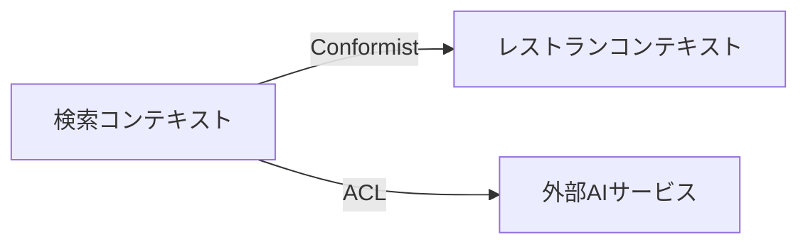
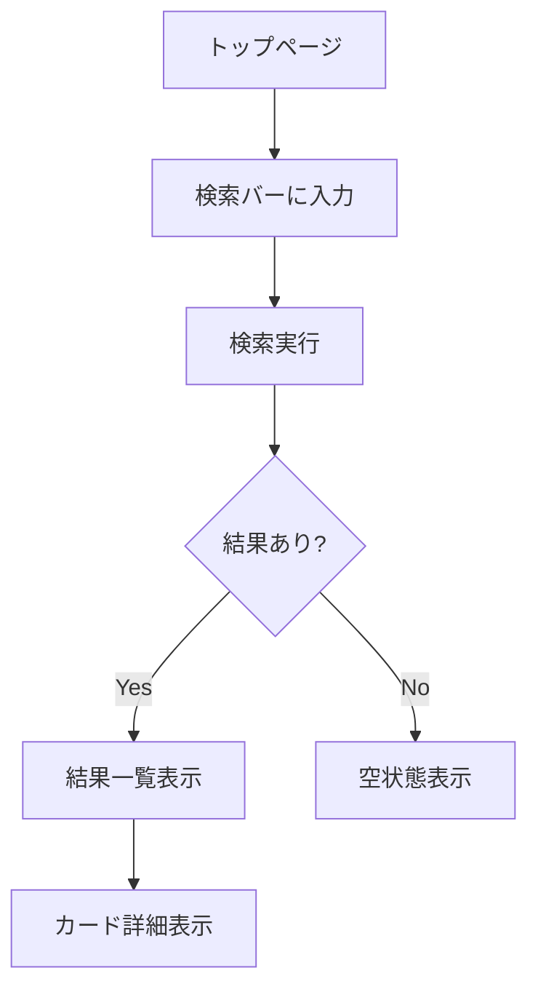

# フェーズ詳細ガイド

各フェーズの詳細な進め方を説明する。SKILL.md の概要とあわせて参照すること。

## ユースケース発見手法（Phase 3）

Phase 3 の目的は「すべてのシナリオを体系的に洗い出す」こと。
「思いつくユースケースを列挙する」アプローチでは、業務に精通していないと重要なシナリオを見落としやすい。
以下の4つの発見手法を順に適用することで、構造的にシナリオを導出する。

### 手法 1: ドメインオブジェクト・ライフサイクル分析

Phase 0 で特定した各エンティティの「ゆりかごから墓場まで」をたどり、ライフサイクル上の各イベントに対してシナリオを導出する。

**手順**:
1. エンティティの状態遷移図を書く（Phase 0 のドメイン構造分解から）
2. 各状態遷移（作成、更新、状態変更、終了）に対して「誰が、いつ、なぜ、この操作をするか」を考える
3. 各操作に対して正常系・異常系のシナリオを導出する

**例: 人材紹介の「契約」エンティティ**:
```
起案 → 条件交渉 → 合意 → 締結（署名・押印）→ 履行中 → [更新 | 終了 | 解除]
```
ここから導出されるシナリオ:
- 契約の起案（新規作成）
- 契約条件の交渉・修正
- 契約の合意・締結
- **契約書原本の保管・管理**（ライフサイクルに付随するドキュメント）
- 契約の履行状況追跡
- 契約の更新（条件変更あり/なし）
- 契約の終了・解除（通常終了 / 途中解約 / 契約違反）

**ドキュメントのライフサイクルも忘れない**: エンティティに付随する書類（契約書原本、覚書、NDA等）は、それ自体がライフサイクルを持つ。作成→保管→検索→閲覧→更新→廃棄のサイクルを考慮する。

### 手法 2: ステークホルダー × ゴールマトリクス

各アクターの視点に立ち、そのアクターがシステムに対して持つゴール（目的）を列挙する。
アクターの視点を意識的に切り替えることで、単一視点では見落としがちなシナリオを発見できる。

**手順**:
1. Phase 0 で特定したステークホルダーを列挙する
2. 各ステークホルダーのゴールを列挙する（「〜として、〜したい」形式で考える）
3. 各ゴールに対して、達成できる場合（正常系）と達成できない場合（異常系）のシナリオを導出する

**例: 人材紹介の契約管理**:

| アクター | ゴール | 正常系 | 異常系 |
|---------|--------|--------|--------|
| 営業担当 | 新規契約を効率的に作成したい | 契約テンプレから作成 | 必須項目未入力で作成失敗 |
| 営業担当 | 契約条件をすぐに確認したい | 契約詳細を検索・閲覧 | 権限のない契約を閲覧しようとする |
| 管理者 | 契約の重要条件を一覧で把握したい | 手数料率・保証期間で絞り込み | 条件が未設定の契約がある |
| 管理者 | 契約書原本を安全に管理したい | 原本のアップロード・保管 | ファイル形式不正、サイズ超過 |
| 候補者 | 自分の契約状況を知りたい | 契約ステータスの確認 | まだ契約が存在しない |

### 手法 3: ビジネスルール駆動シナリオ

Phase 0 で抽出したビジネスルールごとに、ルールが「満たされるケース」と「違反されるケース」の両方のシナリオを導出する。
ルールの漏れは受け入れ基準の漏れに直結するため、ここで全ルールをカバーする。

**手順**:
1. Phase 0 / Phase 2 のビジネスルール一覧を参照する
2. 各ルールに対して: ルール通りに処理される正常系シナリオを導出する
3. 各ルールに対して: ルールに違反する操作が行われた場合のシナリオを導出する（バリデーション、エラー処理、フォールバック）

**例**:
- BR-01「手数料率は理論年収の30〜35%」→ 正常: 33%で契約作成 / 異常: 50%で作成しようとしてバリデーションエラー
- BR-02「返金保証期間は入社後90日以内」→ 正常: 60日目に早期退職で返金処理 / 異常: 91日目に返金請求して期限切れ
- BR-03「契約書は PDF 形式で保管」→ 正常: PDF アップロード成功 / 異常: Word ファイルをアップロードしようとしてエラー

### 手法 4: 横断的関心事の掃き出し

個々の機能シナリオだけでなく、機能を横断する関心事を体系的にチェックする。

| 観点 | チェックポイント | 例 |
|------|----------------|-----|
| 権限・認可 | 誰が何をできるか / できないか | 他人の契約を編集しようとする |
| 監査ログ | 重要操作の追跡が必要か | 契約条件の変更履歴 |
| 通知 | 状態変化時に誰に何を知らせるか | 契約更新期限の事前通知 |
| ドキュメント管理 | 作成・保管・検索・閲覧・アクセス制御 | 契約書原本のバージョン管理 |
| 同時実行 | 複数ユーザーの同時操作 | 同じ契約を2人が同時に編集 |
| データ整合性 | 関連データ間の整合性 | 契約終了時の関連請求データの扱い |

### サブエージェントによる網羅性クロスチェック

上記 4 手法でシナリオを導出した後、ユーザーレビューに回す前に `general-purpose` サブエージェントに独立レビューを委任する。
人間のレビュー負荷を下げ、構造的な漏れを事前に検出することが目的。

**サブエージェントへの指示テンプレート**:
```
以下のドキュメントを読み、ユースケースの網羅性をチェックしてください。

- ユースケース: {usecases.md のパス}
- 要件定義: {prd.md のパス}
- ドメイン構造分解: {Phase 0 の成果物 or インテイクの確認事項}

以下の観点でチェックし、不足があれば具体的に指摘してください:
1. PRD の全 Must Have 要件に対応するユースケースがあるか
2. 全ビジネスルールに正常系・異常系の両方のシナリオがあるか
3. 全エンティティのライフサイクルイベント（作成・更新・状態遷移・削除）がカバーされているか
4. 管理ドキュメントに関するシナリオが含まれているか
5. 横断的関心事（権限、通知、監査ログ等）のシナリオがあるか
```

---

## DDDモデリング詳細（Phase 4）

### 戦略的DDDに集中する理由

戦略的 DDD の目的は「正しい境界で分割し、チーム内で共通の言葉を使う」こと。
実装パターン（エンティティ、値オブジェクト等）は技術設計フェーズで扱うので、ここでは以下に集中する。

### ステップ

#### 1. ユビキタス言語の定義

対象ドメインの用語をユーザーと合わせる。コード上の変数名にもこの用語を使う。

```markdown
## ユビキタス言語

| 用語 | 定義 | コード上の表現 |
|------|------|----------------|
| 検索意図 | ユーザーの自然言語入力から抽出した構造化された要求 | `SearchIntent` |
| マッチスコア | レストランと検索意図の適合度（0-100） | `matchScore` |
```

用語は既存コードベースで使われている名前との整合性を必ず確認する。
乖離がある場合はリネームの提案をドメインに関する確認事項に記載。

#### 2. 境界づけられたコンテキスト

機能を独立したコンテキストに分割する。小規模プロジェクトでもコンテキストを意識することで、ディレクトリ構成やモジュール分割の指針になる。

```markdown
## 境界づけられたコンテキスト

### 検索コンテキスト
- 責務: ユーザー入力の解釈、検索実行、結果のランキング
- 主要概念: SearchQuery, SearchIntent, SearchResult
- 外部依存: レストランコンテキスト（読み取りのみ）

### レストランコンテキスト
- 責務: レストラン情報の管理、カテゴリ分類
- 主要概念: Restaurant, Category, Location
- 外部依存: なし
```

#### 3. コンテキストマップ

コンテキスト間の関係を Mermaid で可視化する。



関係パターン（Conformist, ACL, Shared Kernel 等）を明示する。

#### 4. ドメインイベント

システム内で重要な出来事を洗い出す。これが後の API 設計やイベント駆動設計の入力になる。

```markdown
## ドメインイベント

| イベント | トリガー | 発行元 | 消費者 |
|---------|---------|--------|--------|
| SearchExecuted | ユーザーが検索を実行 | 検索コンテキスト | 分析コンテキスト |
```

#### 5. 既存コードとの整合性

新しいドメインモデルが既存のコード構造とどう対応するか分析する。
既存の命名・ディレクトリ構成との整合性を評価し、必要な変更を提案する。

---

## UI/UXデザイン詳細（Phase 5）

### Storybook プロトタイピングの進め方

Phase 5 の目的は「ユーザーがブラウザで動作確認できるプロトタイプ」を作ること。
完全な機能実装ではなく、UI の見た目・インタラクションの合意を得ることが目標。

### ステップ

#### 1. ユーザーフロー設計

ユーザーが機能をどう使うか、フロー図で整理する。



#### 2. コンポーネント設計

新規コンポーネントと既存コンポーネントの再利用を整理する。

```markdown
## コンポーネント構成

### 新規作成
- `FilterPanel/` — 検索フィルターUI
  - props: filters, onFilterChange
  - 状態: 選択中のフィルター値

### 既存再利用
- `SearchBar/` — 既存の検索バー（変更なし）
- `RestaurantCard/` — 既存のカード（プロップ追加の可能性）

### shadcn/ui 使用
- `Select` — フィルタードロップダウン
- `Checkbox` — 複数選択フィルター
```

#### 3. Storybook ストーリー作成

プロトタイプとして以下の粒度で作成する:

- **個別コンポーネント**: 各状態（デフォルト、ローディング、エラー、空）のストーリー
- **コンポジション**: 複数コンポーネントを組み合わせた画面レベルのストーリー

```typescript
// FilterPanel/FilterPanel.stories.tsx
import type { Meta, StoryObj } from '@storybook/react';
import { FilterPanel } from './FilterPanel';

const meta = {
  title: 'Features/Search/FilterPanel',
  component: FilterPanel,
  tags: ['autodocs'],
} satisfies Meta<typeof FilterPanel>;

export default meta;
type Story = StoryObj<typeof meta>;

export const Default: Story = {
  args: {
    filters: mockFilters,
    onFilterChange: fn(),
  },
};

export const WithSelection: Story = { /* ... */ };
export const Loading: Story = { /* ... */ };
export const Empty: Story = { /* ... */ };
```

**重要**: プロトタイプ段階では:
- API 呼び出しはモックデータで代替
- 状態管理は最小限（ローカル state のみ）
- スタイリングはプロジェクトの既存パターンに合わせる（shadcn/ui + Tailwind）
- 既存コンポーネントの配置場所・命名規約に従う

#### 4. インタラクション定義

状態遷移とフィードバックを明示する。

```markdown
## インタラクション

| 操作 | 状態変化 | フィードバック |
|------|---------|---------------|
| フィルター選択 | selected → applied | 即時反映、件数更新 |
| 検索実行中 | idle → loading | スケルトンUI表示 |
| エラー発生 | → error | Alert コンポーネント表示 |
```

#### 5. アクセシビリティ

- キーボードナビゲーション
- スクリーンリーダー対応（aria-label 等）
- カラーコントラスト
- フォーカス管理

---

## 実装パターン（Phase 7）

### 段階的実装の原則

1. **依存関係の順にボトムアップで実装**: DB スキーマ → バックエンド → フロントエンド
2. **各ステップで動作確認可能な状態を保つ**: 中間状態でもテスト可能にする
3. **既存パターンに従う**: 新しいパターンを導入する前に、既存コードの慣習を確認する

### サブエージェントによる並行実装

独立性が高い場合（例: バックエンド API とフロントエンド UI が interface で切れている場合）、サブエージェントで並行実装できる。

**並行実装の条件**:
- 編集対象のファイルが完全に分離されている
- 共通の型定義が先に確定している
- インターフェース（API 契約）が合意済み

**委任時の指示テンプレート**:
```
以下のタスクを実装してください:
- 対象: {コンポーネント/モジュール名}
- 技術設計: {technical-design.md のパス}（該当セクションを参照）
- プロジェクト規約: {CLAUDE.md のパス}
- 既存パターン参考: {既存の類似ファイルのパス}
- 出力先: {ディレクトリパス}
```

---

## テスト戦略（Phase 8）

### ユースケースからテストへの変換

`usecases.md` の各シナリオを対応するテストに変換する。

| ユースケース種別 | テスト種別 | 例 |
|-----------------|----------|-----|
| 正常系 | ユニット + 統合 | 有効な入力で期待通りの結果 |
| 異常系 | ユニット | バリデーションエラーの検証 |
| エッジケース | ユニット | 境界値、null/undefined |
| ユーザーフロー | E2E | 画面操作の一連の流れ |

### テスト作成の優先順位

1. **ビジネスロジック**: ドメイン層のロジック（最優先）
2. **API エンドポイント**: リクエスト/レスポンスの検証
3. **UI インタラクション**: ユーザー操作とフィードバック
4. **E2E**: 主要ハッピーパスのみ（コスト対効果を考慮）

### テスト品質チェック

- テスト名がシナリオを説明しているか
- Arrange-Act-Assert パターンに従っているか
- モックの範囲が適切か（過剰モックを避ける）
- フレイキーテストの兆候がないか

---

## MVP-UAT 詳細（Phase 8）

### なぜ自動テストだけでは不十分か

自動テスト（ユニット・統合・E2E）はコードの振る舞いを検証するが、以下の問題は検出しにくい:
- **バリデーションルールの不整合**: フロントとバックエンドでルールが異なり、登録時にエラーになる
- **画面遷移の不備**: 操作後に適切な画面に遷移しない、エラー後の復帰パスがない
- **データ表示の不整合**: 登録したデータが一覧画面に反映されない、表示フォーマットがおかしい
- **操作フローの断絶**: 一連の業務フローを通しで実行すると途中で行き詰まる

MVP-UAT はこれらを「実際に動かして」検出する。

### サブエージェントへの委任方法

**指示テンプレート**:
```
以下のドキュメントを参照し、MVP 観点での受け入れテストを実施してください。

- ユースケース: {usecases.md のパス}
- 技術設計: {technical-design.md のパス}
- プロジェクト規約: {CLAUDE.md のパス}

手順:
1. アプリケーションを起動する（{起動コマンド}）
2. usecases.md の Must Have 正常系シナリオを対象に、以下の方法で各シナリオを再現する:
   - バックエンド API: curl や httpie で API を直接呼び出す
   - フロントエンド: （E2E テストツールがある場合）ブラウザ操作で再現する
3. 各シナリオの「期待結果」と実際の結果を比較する
4. 結果を以下の形式で報告する:

## UAT 結果

### 成功シナリオ
| UC ID | シナリオ名 | 結果 |
|-------|-----------|------|
| UC-01 | {名前} | OK |

### 不具合
| UC ID | シナリオ名 | 重要度 | 期待結果 | 実際の結果 | 再現手順 |
|-------|-----------|--------|---------|-----------|---------|
| UC-02 | {名前} | blocker | {期待} | {実際} | {手順} |

重要度の判断基準:
- blocker: MVP として使えない（主要フローが完了できない）
- major: 主要機能に支障がある（データ不正、重要な表示エラー等）
- minor: 動作はするが品質に問題がある（表示崩れ、UX 上の違和感等）
```

### UAT 結果への対応

1. **blocker**: 即座に修正。Phase 7 に戻って該当箇所を修正し、自動テスト → UAT を再実行
2. **major**: 原則修正。修正コストが高い場合はユーザーに相談
3. **minor**: ユーザーに報告し、今回対応するか次回以降にするか判断を仰ぐ
