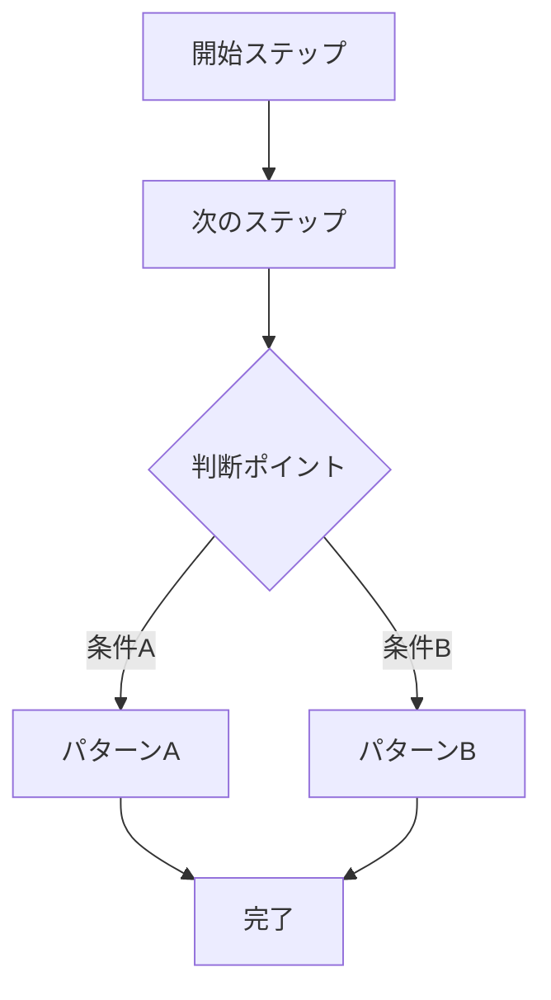
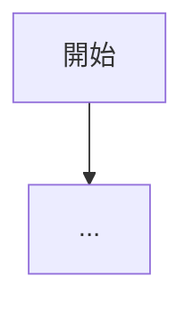
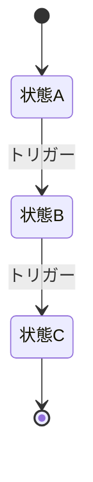

# 業務フローテンプレート (`business-flow.md`)

````markdown
# 業務フロー

> 最終更新: YYYY-MM-DD ｜ サブフェーズ1で作成・更新

## 概要

（業務の全体的な説明。1〜3段落で、業界、主要なアクター、ビジネスモデルを簡潔にまとめる）

## アクター一覧

| アクター | 役割 | 主な業務 |
|---------|------|---------|
| （アクター名） | （役割の説明） | （担当する業務の概要） |

## メインフロー: （フロー名）

（業務の主要な流れを端から端まで記述する）



### フローの説明

| ステップ | 担当 | 内容 | 入力 | 出力 |
|---------|------|------|------|------|
| 1 | （アクター） | （何をするか） | （必要な情報） | （生成される情報） |

## サブフロー: （サブフロー名）

（個別の業務フローをメインフローと同じ形式で記述。サブフローごとにセクションを分ける）



## 業務ルール

- **BR-001**: （ルールの内容）
- **BR-002**: （ルールの内容）

## ステータス遷移

（主要なエンティティのステータス遷移がある場合、Mermaid stateDiagram で記述）


````
