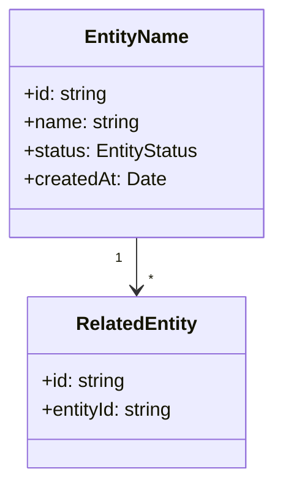
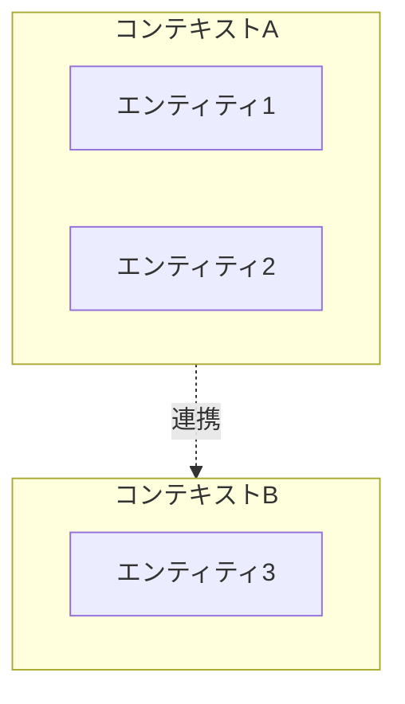

# ドメインモデルテンプレート (`domain-model.md`)

````markdown
# ドメインモデル

> 最終更新: YYYY-MM-DD ｜ サブフェーズ1で作成、サブフェーズ2で更新

## モデル図



## エンティティ詳細

### （エンティティ名）（日本語名）

- **説明**: （このエンティティが表す概念）
- **主な属性**:
  - `id`: 一意識別子
  - `name`: （属性の説明）
  - `status`: （ステータスの種類を列挙）
- **関連**: （他エンティティとの関係を記述）
- **備考**: （補足事項）

（エンティティの数だけ繰り返す）

## 値オブジェクト

| 名前 | 型 | 取りうる値 | 説明 |
|------|---|-----------|------|
| （例: OrderStatus） | enum | pending, confirmed, shipped, delivered | 注文のステータス |

## 境界づけられたコンテキスト



| コンテキスト | 含まれるエンティティ | 責務 |
|------------|-------------------|------|
| （コンテキスト名） | （エンティティ一覧） | （このコンテキストの責務） |
````
