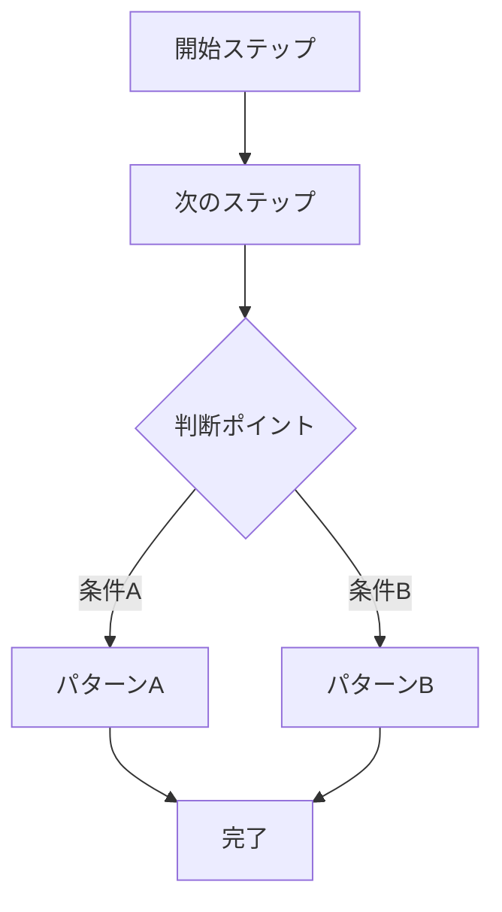
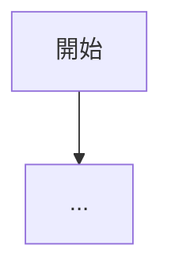
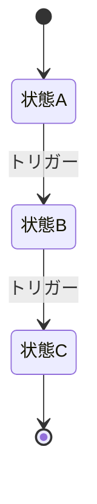
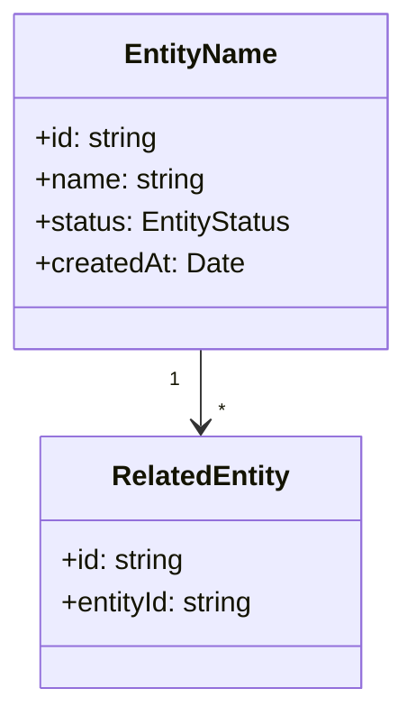
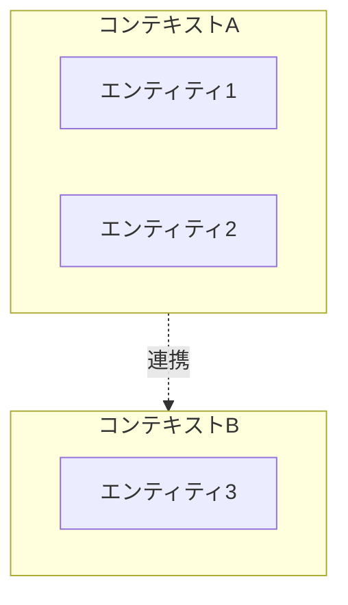

# 成果物テンプレート

このファイルには、discover スキルで生成する各成果物の正式なテンプレートを定義する。
成果物を生成・更新する際は、必ずこのテンプレートに従うこと。

---

## 1. 業務フロー (`business-flow.md`)

```markdown
# 業務フロー

> 最終更新: YYYY-MM-DD ｜ サブフェーズ1で作成・更新

## 概要

（業務の全体的な説明。1〜3段落で、業界、主要なアクター、ビジネスモデルを簡潔にまとめる）

## アクター一覧

| アクター | 役割 | 主な業務 |
|---------|------|---------|
| （アクター名） | （役割の説明） | （担当する業務の概要） |

## メインフロー: （フロー名）

（業務の主要な流れを端から端まで記述する）



### フローの説明

| ステップ | 担当 | 内容 | 入力 | 出力 |
|---------|------|------|------|------|
| 1 | （アクター） | （何をするか） | （必要な情報） | （生成される情報） |

## サブフロー: （サブフロー名）

（個別の業務フローをメインフローと同じ形式で記述。サブフローごとにセクションを分ける）



## 業務ルール

（発見された業務ルールを箇条書きで列挙する）

- **BR-001**: （ルールの内容）
- **BR-002**: （ルールの内容）

## ステータス遷移

（主要なエンティティのステータス遷移がある場合、Mermaid stateDiagram で記述）


```

---

## 2. ドメインモデル (`domain-model.md`)

```markdown
# ドメインモデル

> 最終更新: YYYY-MM-DD ｜ サブフェーズ1で作成、サブフェーズ2で更新

## モデル図



## エンティティ詳細

### （エンティティ名）（日本語名）

- **説明**: （このエンティティが表す概念）
- **主な属性**:
  - `id`: 一意識別子
  - `name`: （属性の説明）
  - `status`: （ステータスの種類を列挙）
- **関連**: （他エンティティとの関係を記述）
- **備考**: （補足事項）

（エンティティの数だけ繰り返す）

## 値オブジェクト

| 名前 | 型 | 取りうる値 | 説明 |
|------|---|-----------|------|
| （例: OrderStatus） | enum | pending, confirmed, shipped, delivered | 注文のステータス |

## 境界づけられたコンテキスト



| コンテキスト | 含まれるエンティティ | 責務 |
|------------|-------------------|------|
| （コンテキスト名） | （エンティティ一覧） | （このコンテキストの責務） |
```

---

## 3. 未確認事項リスト (`unconfirmed-items.md`)

```markdown
# 未確認事項リスト

> PMとの対話を通じて確認が必要な項目の一覧。優先度「高」の項目から順に確認していく。
> 最終更新: YYYY-MM-DD

| ID | 未確認事項 | 関連する業務フロー | 優先度 | 確認先 | ステータス |
|----|-----------|-----------------|--------|--------|----------|
| U-001 | （確認が必要な事項を具体的に記述） | （関連するフロー名） | 高/中/低 | PM/ドメインエキスパート/法務/経理 | 未確認/確認済 |

## 確認の優先順位

### 最優先（次回の対話で確認）
- U-XXX: （項目名）-- （なぜ最優先か）

### 次に確認（ドメインエキスパートへの確認が必要）
- U-XXX: （項目名）

### 後回し可能
- U-XXX: （項目名）

## 確認済み事項の記録

| ID | 確認事項 | 確認結果 | 確認日 | 確認者 |
|----|---------|---------|--------|--------|
| U-XXX | （元の質問） | （確認結果の要約） | YYYY-MM-DD | （誰に確認したか） |
```

### 未確認事項の記載ルール

- **ID**: `U-001` から連番。削除・欠番にしない
- **優先度の基準**:
  - 高: 業務フロー全体の構造やシステムの方向性に影響する
  - 中: 個別のフローや機能の設計に影響する
  - 低: 細かい仕様やUI上の選択に影響する
- **確認先**: PMだけでは答えられない項目は、適切な確認先を明記する
- **ステータス**: 確認されたら「確認済」に変更し、「確認済み事項の記録」セクションに結果を転記する

---

## 4. 要求管理表 (`requirements-table.md`)

```markdown
# 要求管理表

> 最終更新: YYYY-MM-DD ｜ サブフェーズ2で作成

## 凡例
- **優先度**: Must（必須）/ Should（重要）/ Could（あれば良い）/ Won't（今回は対象外）
- **MVP対象**: ○（MVPに含む）/ -（MVP後）

## サマリー

| 優先度 | 件数 | MVP対象 |
|--------|------|---------|
| Must | X件 | X件 |
| Should | X件 | X件 |
| Could | X件 | 0件 |
| Won't | X件 | 0件 |
| **合計** | **X件** | **X件** |

---

## （カテゴリ名）

| ID | 要求内容 | 優先度 | MVP対象 | 関連UC | 備考 |
|----|---------|--------|---------|--------|------|
| REQ-001 | （ユーザーが何をできるか、を具体的に記述） | Must | ○ | UC-001 | （補足事項） |

（カテゴリごとにセクションを分けてテーブルを作成する）
```

### 要求の記載ルール

- **ID**: `REQ-001` から連番。カテゴリが変わっても連番を継続する
- **要求内容**: 「〜できる」の形で記述。主語（アクター）が自明な場合は省略可
- **優先度の基準**（MoSCoW法）:
  - Must: これがないとシステムとして成立しない
  - Should: 重要だが、なくても最低限は動く
  - Could: あれば便利だが、優先度は低い
  - Won't: 今回のスコープには含めない
- **MVP対象**: Must は原則 ○。Should は PM と相談して決める。Could/Won't は -
- **関連UC**: ユースケースIDを記載。複数の場合はカンマ区切り

---

## 5. ユースケース一覧 (`usecases.md`)

```markdown
# ユースケース一覧

> 最終更新: YYYY-MM-DD ｜ サブフェーズ2で作成

## ユースケース一覧表

| ID | ユースケース名 | アクター | MVP対象 |
|----|--------------|---------|---------|
| UC-001 | （ユースケース名） | （アクター名） | ○/- |

---

## UC-001: （ユースケース名）

- **アクター**: （誰がこの操作を行うか）
- **事前条件**: （この操作を行うために満たすべき条件）
- **主フロー**:
  1. （ユーザーの操作またはシステムの動作を、番号付きで順に記述）
  2. ...
  3. ...
- **代替フロー**:
  - Xa. （主フローのステップXで条件が異なる場合の分岐。「X」は主フローのステップ番号）
  - Xb. （同じステップで別の分岐がある場合）
- **事後条件**: （この操作が完了した後のシステムの状態）
- **関連要求**: REQ-XXX, REQ-XXX
- **備考**: （任意。UI上の注意点や業務上の制約など）
```

### ユースケースの記載ルール

- **ID**: `UC-001` から連番
- **名前**: 「〜する」の動詞形で記述。アクターの視点で書く
- **主フロー**: ユーザーの操作とシステムの応答を交互に記述。1ステップ1アクション
- **代替フロー**: 例外・エラー・分岐。主フローのステップ番号を接頭辞にする
- **関連要求**: この UC を実現するために必要な REQ を列挙
